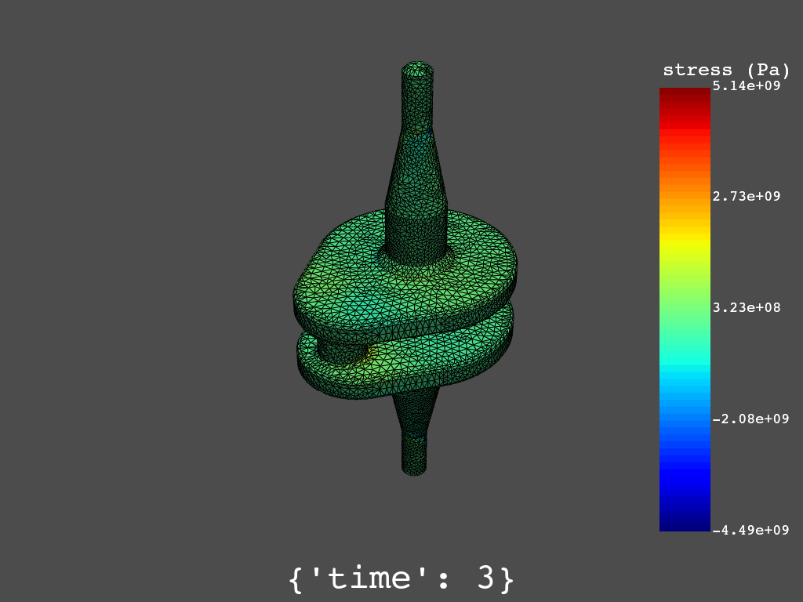

.. _user_guide_plotting:

************
Plot results
************

PyDPF-Post provides functionality for plotting results. Here is a summary of
the steps:

#. Load the :class:`Simulation <ansys.dpf.post.simulation.Simulation>` object
   with the result file.
#. Request a :class:`DataFrame <ansys.dpf.post.dataframe.DataFrame>` object to
   obtain the scalar field of interest.
#. Use the plotting methods of the :class:`DataFrame <ansys.dpf.post.dataframe.DataFrame>` object
   to render it.

Some plotting examples follow.

Total deformation 
-----------------

This code shows how to plot the total deformation (norm of the displacement vector field):

.. code:: python

    Instantiate the solution object

    >>> from ansys.dpf import post
    >>> from ansys.dpf.post import examples
    >>> simulation = post.load_simulation(examples.download_crankshaft())

    Instantiate a DataFrame object containing the displacement norm data

    >>> displacement_norm = simulation.displacement(norm=True)

    Plot the data and save the image

    >>> displacement_norm.plot(screenshot="crankshaft_disp.png")

.. figure:: ./../images/crankshaft_disp.png
    :width: 300pt
    :align: left

Normal stresses
---------------

Plotting of raw data at Gauss points is not available.
However, you can plot data averaged at nodes or elements.

This code shows how to plot the nodal xx-component of stress:

.. code:: python

    Instantiate the simulation object

    >>> from ansys.dpf import post
    >>> from ansys.dpf.post import examples
    >>> simulation = post.load_simulation(examples.download_crankshaft())

    Extract the XX stress data

    >>> stress_xx = simulation.stress_nodal(components=["XX"])

    Plot the data and save the image

    >>> stress_xx.plot(screenshot="crankshaft_stress_xx.png")

