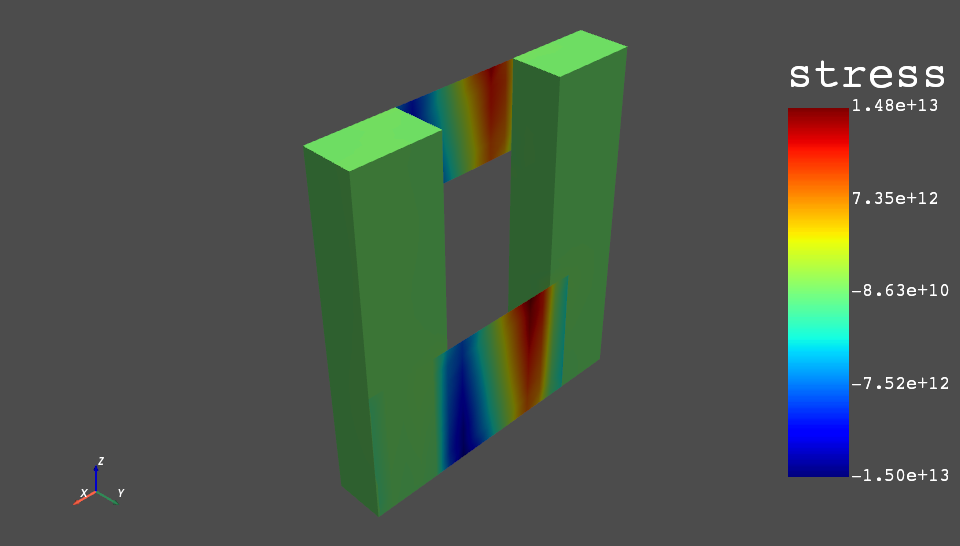

================
PyAnsys DPF-Post
================
The Data Processing Framework (DPF) is designed to provide numerical
simulation users/engineers with a toolbox for accessing and
transforming simulation data. DPF can access data from solver result
files as well as several neutral formats (csv, hdf5, vtk,
etc.). Various operators are available allowing the manipulation and
the transformation of this data.

The Python ``ansys.dpf.post`` module provides an simplified Python
interface to DPF, thus enabling rapid post-processing, without ever
leaving a Python environment. 

This module leverages the DPF-Core module ``ansys.dpf.core`` module
and can be found by visiting `DPF-Core GitHub
<https://github.com/pyansys/DPF-Core>`_.  Use ``ansys.dpf.core`` for
building more advanced and customized workflows using Ansys's DPF.

Brief Demo
~~~~~~~~~~
Opening and plotting a result file generated from Ansys workbench or
MAPDL is as easy as:

.. code:: python

    >>> from ansys.dpf import post
    >>> from ansys.dpf.post import examples
    >>> solution = post.load_solution(examples.multishells_rst)
    >>> stress = solution.stress()
    >>> stress.xx.plot_contour(show_edges=False)

    Basic Stress Contour Plot

Or extract the raw data as a ``numpy`` array with

.. code:: python

   >>> stress.xx.get_data_at_field(0)
   array([-3.37871094e+10, -4.42471752e+10, -4.13249463e+10, ...,
           3.66408342e+10,  1.40736914e+11,  1.38633557e+11])

See the :ref:`gallery` for more detailed examples.

Key Features
~~~~~~~~~~~~

**Computational Efficiency**

The DPF-Post module is based on DPF Framework that been developed with
a data framework that localizes the loading and post-processing within
the DPF server, enabling rapid post-processing workflows as this is
written in C and FORTRAN.  At the same time, the DPF-Post Python
module presents the result in Pythonic manner, allowing for the rapid
development of simple or complex post-processing scripts.

**Easy to use**

The API of DPF-Post module has been developed in order to make easy
post-processing steps easier by automating the use of DPF's chained
operators.  This allows for fast post-processing of potentially
multi-gigabyte models in a short script.  DPF-Post also details the
usage of the operators used when computing the results so you can also
build your own custom, low level scripts using the
`DPF-Core <https://github.com/pyansys/DPF-Core>`_ module.

.. toctree::
   :maxdepth: 2
   :caption: Getting Started
   :hidden:

   getting_started/index
   user_guide/index
   api/index
   examples/index
   contributing
