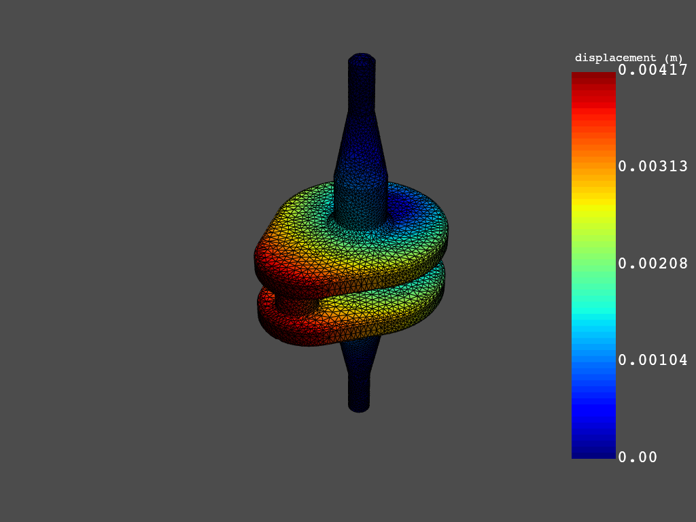
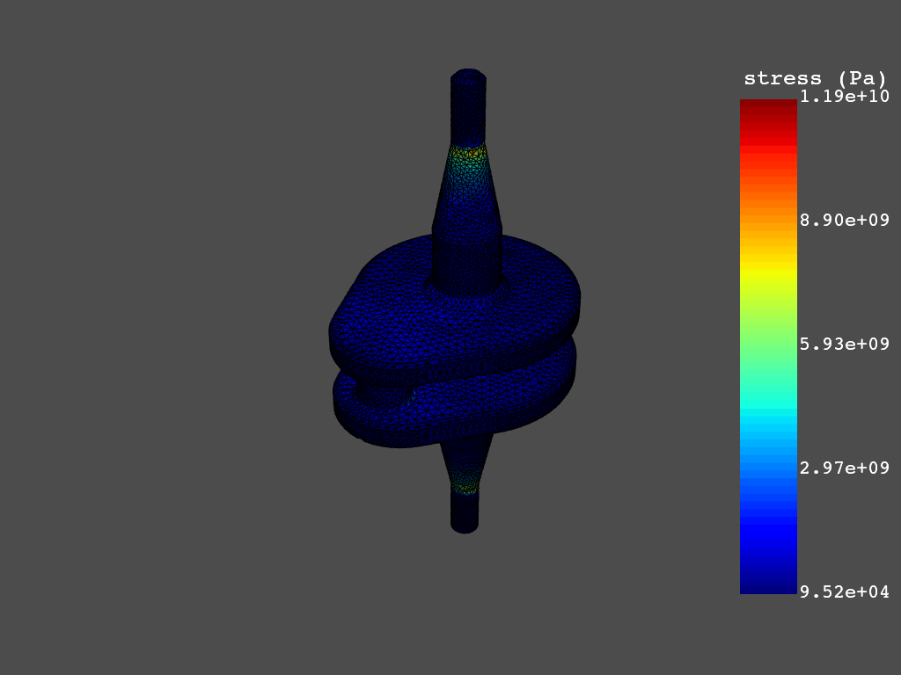

==========
PyDPF-Post
==========

The Data Processing Framework (DPF) is designed to provide numerical
simulation users/engineers with a toolbox for accessing and
transforming simulation data.

The Python `ansys-dpf-post` package provides a high level, physics oriented API for postprocessing.
Loading a simulation (defined by its result files) allows you to extract simulation metadata as well
as results and apply postprocessing operations on it.

This module leverages the PyDPF-Core project's ``ansys-dpf-core`` package and can
be found by visiting [PyDPF-Core GitHub](https://github.com/pyansys/pydpf-core).
Use ``ansys-dpf-core`` for building more advanced and customized workflows using Ansys DPF.

Brief demo
~~~~~~~~~~

Provided you have ANSYS 2023 R1 installed, a DPF server starts
automatically once you start using PyDPF-Post.
Loading a simulation for a MAPDL result file to extract and post-process results:

.. code:: python

    >>> from ansys.dpf import post
    >>> from ansys.dpf.post import examples
    >>> simulation = post.load_simulation(examples.download_crankshaft())
    >>> displacement = simulation.displacement()
    >>> print(displacement)

.. rst-class:: sphx-glr-script-out

 .. code-block:: none

             results         U
              set_id         3
      node      comp
      4872         X -3.41e-05
                   Y  1.54e-03
                   Z -2.64e-06
      9005         X -5.56e-05
                   Y  1.44e-03
                   Z  5.31e-06
       ...

.. code:: python

    >>> displacement.plot()

.. code:: python

    >>> stress_eqv = simulation.stress_eqv_von_mises_nodal()
    >>> stress_eqv.plot()

To run PyDPF-Post with Ansys versions starting from 2021 R1 to 2022 R2, use the following legacy PyDPF-Post
tools:

.. code:: python

    >>> from ansys.dpf import post
    >>> from ansys.dpf.post import examples
    >>> solution = post.load_solution(examples.download_crankshaft())
    >>> stress = solution.stress()
    >>> stress.eqv.plot_contour(show_edges=False)

For comprehensive demos, see :ref:`gallery`.

Key features
~~~~~~~~~~~~

**Computational efficiency**

PyDPF-Post is based on DPF, whose data framework localizes loading and
postprocessing on the DPF server, enabling rapid postprocessing workflows
because they are written in C and FORTRAN. Because DPF-Post presents results
in a Pythonic manner, you can rapidly develop simple or complex postprocessing
scripts.

**Easy to use**

The PyDPF-Post API automates the use of chained DPF operators to make
postprocessing easier. The PyDPF-Post documentation describes how you can
use operators to compute results. This allows you to build your own custom,
low-level scripts to enable fast postprocessing of potentially multi-gigabyte
models using `PyDPF-Core <https://github.com/pyansys/pydpf-core>`_.

.. toctree::
   :maxdepth: 2
   :caption: Getting Started
   :hidden:

   getting_started/index
   user_guide/index
   api/index
   examples/index
   contributing
